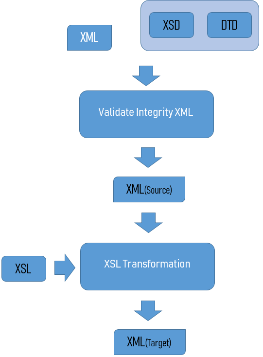

# STAX Module
> STandard Api for Xml procesing

STAX Module, provides the ability to convert XML to XMI, obtaining as input XML files with a predefined structure, and with XSLT scripts (XSL Transformations) generate XMI files.

## Operation

    

